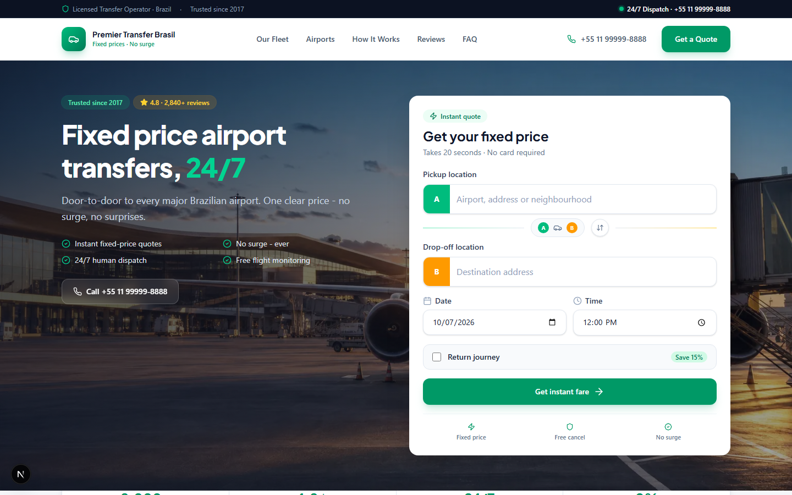
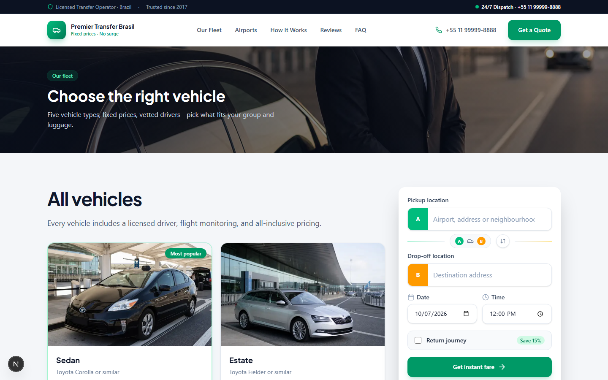
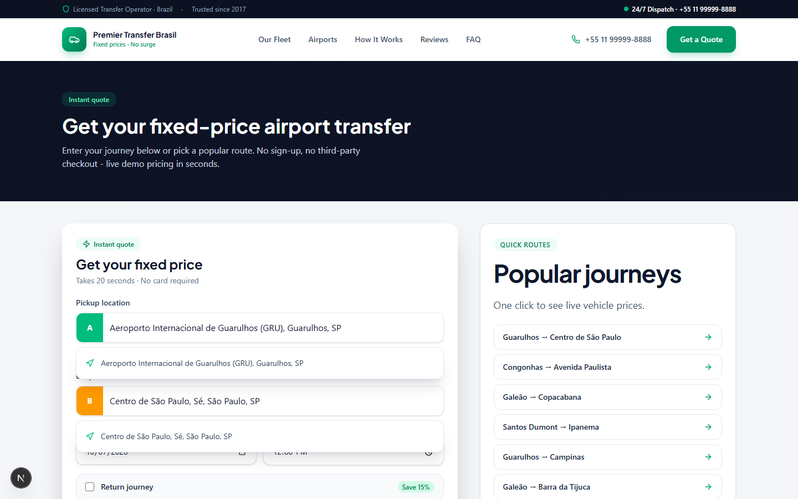
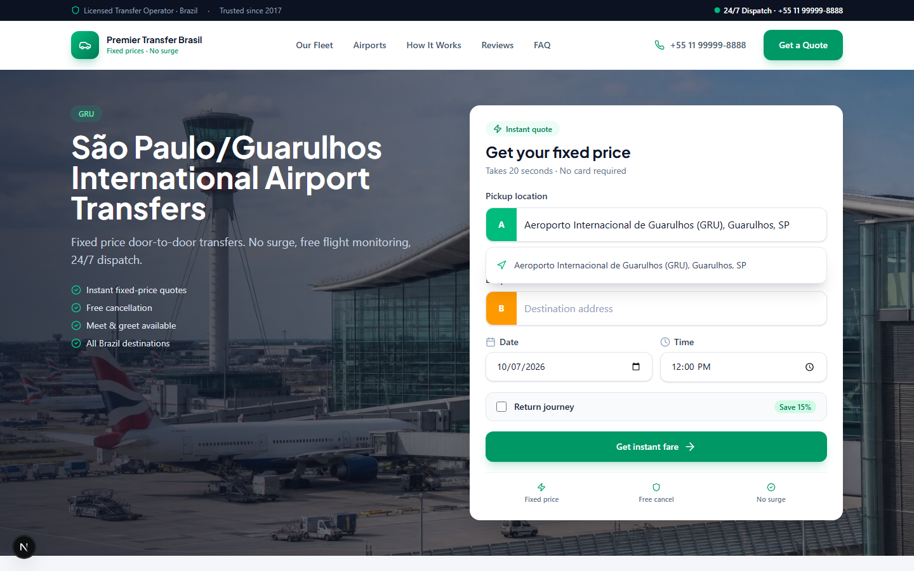

# Premier Transfer Brasil — Airport Transfer Booking (Brazil demo)






A demo airport-transfer booking platform set in Brazil: fixed-price quotes in **BRL**, six major Brazilian airports, and a small operations admin. Built with **Next.js 15 (App Router)**, **React 19**, **Tailwind CSS 4**, **Prisma** and **SQLite**.

Built by **Alexsandro Sunaga**. "Premier Transfer Brasil", phone numbers, e-mail addresses, reviews, and statistics are fictional sample data for demonstration.

## What is in the app

### Customer site
- Home page with a quote widget (pickup, drop-off, date, time, one-way or return)
- Location autocomplete served by `/api/places`: built-in Brazilian airports and destinations, optionally Google Maps
- Airports covered: GRU, CGH (São Paulo), GIG, SDU (Rio de Janeiro), BSB (Brasília), CNF (Belo Horizonte)
- Sample destinations such as Avenida Paulista, Copacabana, Ipanema, Campinas and Santos, plus popular-route cards
- Vehicle quotes for five classes (Sedan, Estate, Van, Executive, 8-Seater) with per-class multipliers
- Multi-step booking flow at `/book`: vehicle, passenger details, payment choice (online or pay the driver), confirmation with a `PTB-XXXXXX` reference
- Fleet page (`/fleet`), per-airport/location pages (`/locations/[slug]`), FAQ, how-it-works and testimonials
- `sitemap.xml` and `robots.txt`; prices formatted with `pt-BR` / `BRL`

### Admin (`/admin`)
- JWT cookie login (`/admin/login`, `jose` + `bcryptjs`), protected by `src/middleware.ts`
- Dashboard, bookings list, pricing rules, vehicle types and API settings pages
- Pricing rule: base fare, per-km rate, per-minute rate, minimum fare, airport fee and a night multiplier (22:00-06:00); an optional surge rule exists but is off by default
- API settings table for Maps, Stripe, Twilio and SendGrid keys (stored only; the Next.js app does not call those services)

### API routes (`src/app/api`)
`POST /api/quote`, `GET /api/places`, `POST /api/bookings`, `POST /api/auth/login`, `POST /api/auth/logout`, and `/api/admin/{dashboard,pricing,settings,vehicles}`.

### Optional extras in `stack/`
A separate FastAPI quote/booking service (`stack/api`, port 8010) and a Vite + Mantine SPA (`stack/product-web`). They are standalone portfolio add-ons and are not needed to run the Next.js site. See `stack/README.md`.

## Run locally

Requires Node.js 20+.

```bash
npm install
cp .env.example .env
npm run db:push
npm run db:seed
npm run dev
```

- Site: http://localhost:3000
- Admin: http://localhost:3000/admin/login

`db:seed` creates the admin user (from `ADMIN_EMAIL` / `ADMIN_PASSWORD`, defaulting to a placeholder address and `admin123`), the vehicle types, the "Standard Brazil Rates" pricing rule, the API setting keys and two sample bookings for São Paulo (GRU) and Rio (GIG).

### Scripts

| Script | Purpose |
|--------|---------|
| `npm run dev` | Next.js dev server (port 3000) |
| `npm run build` / `npm start` | Production build and server |
| `npm run lint` | ESLint |
| `npm run db:generate` | `prisma generate` |
| `npm run db:push` | Create or update the SQLite schema |
| `npm run db:seed` | Seed data via `tsx prisma/seed.ts` |

### Optional: FastAPI service

```bash
cd stack/api
python -m venv .venv && .venv\Scripts\activate
pip install -r requirements.txt
uvicorn src.main:backend_app --reload --port 8010
```

## Environment

See `.env.example`: `DATABASE_URL`, `JWT_SECRET`, `ADMIN_EMAIL`, `ADMIN_PASSWORD`, `NEXT_PUBLIC_SITE_URL`, and optional `GOOGLE_MAPS_API_KEY` / `NEXT_PUBLIC_GOOGLE_MAPS_API_KEY`. Without Maps keys the built-in Brazilian places are used. Change `JWT_SECRET` and the admin password before any real deployment.

## Structure

```
prisma/        schema.prisma (AdminUser, VehicleType, PricingRule, SurgeRule, Customer, Booking, ApiSetting) and seed.ts
src/app/       pages (home, book, fleet, locations, admin) and API routes
src/components booking flow, layout and UI components
src/lib/       pricing, auth, validation, Brazil constants (airports, routes, FAQ)
stack/api      optional FastAPI service
stack/product-web  optional Vite SPA
```

## Author

**Alexsandro Sunaga**

## License

MIT License — see [LICENSE](LICENSE).
